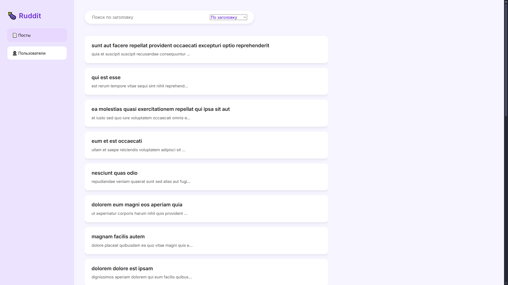
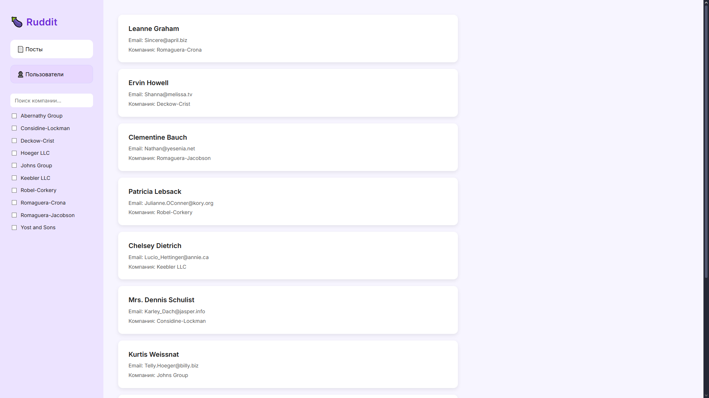
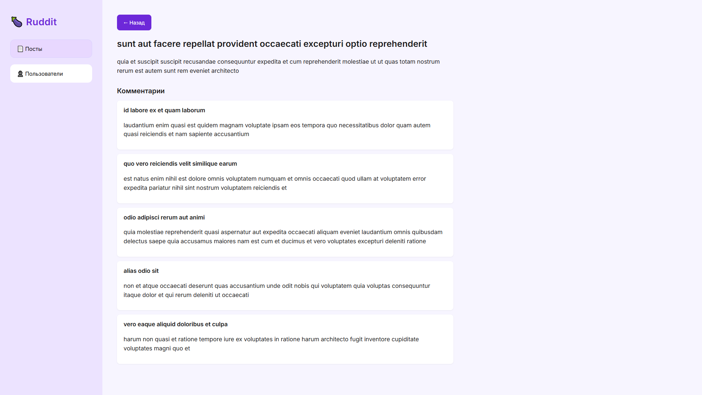
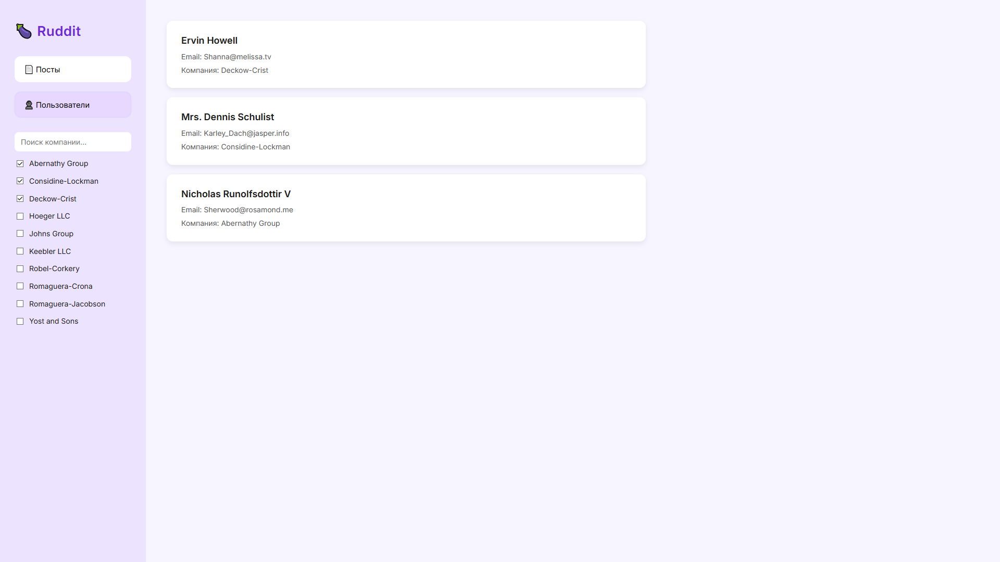
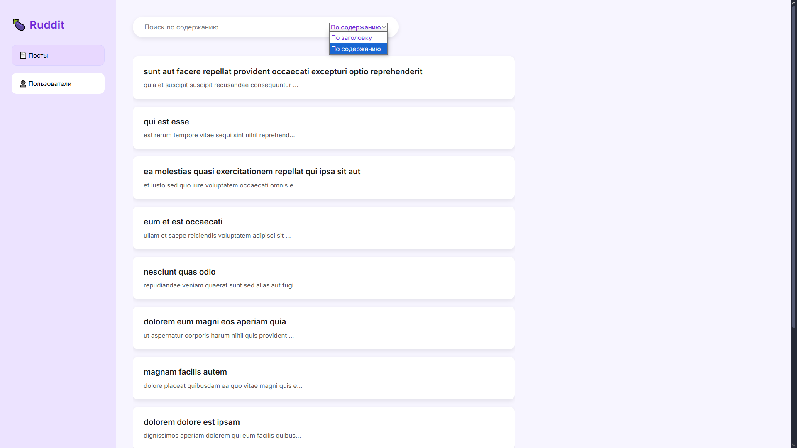

~~~ Инструкция по запуску:
# 1. Клонируйте код и зайдите в папку с кодом.
git clone https://github.com/ALEXKLY910/Ruddit.git
cd Ruddit
2. Скачайте npm в папку с кодом.
npm install
3. Запустите dev сервер.
npm run dev             # http://localhost:5173

